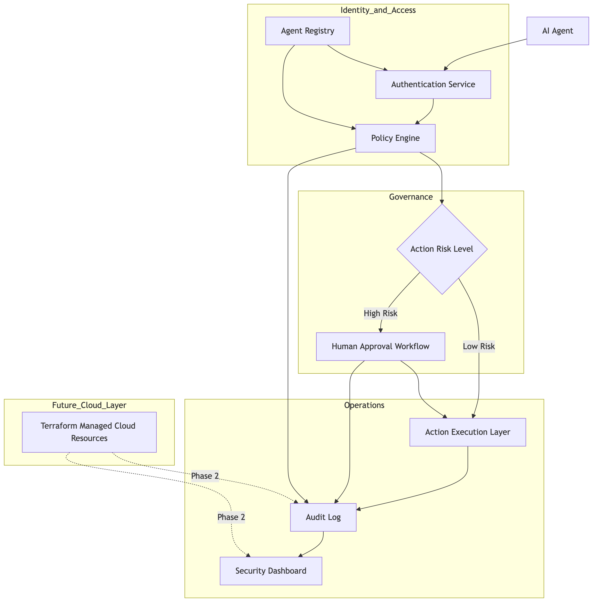

# AgentVault

## Secure Identity Governance for Autonomous AI Agents

AgentVault is a cybersecurity lab that demonstrates how autonomous AI agents can be managed securely using identity governance, least privilege access, policy enforcement, approval workflows, and audit logging.

The project simulates multiple AI agents performing tasks within a controlled environment where every action is authenticated, authorized, monitored, and recorded.

## Problem Statement

As autonomous AI agents become part of enterprise workflows, they introduce a new identity security challenge: agents can request access, execute actions, and interact with systems without the same governance controls used for human users.

AgentVault demonstrates how AI agents can be governed using least privilege, role-based access control, policy checks, human approval, and audit logging.

## Project Scope

AgentVault will simulate a secure environment where AI agents must authenticate, request permission, and follow governance rules before performing sensitive actions.

The project will focus on:

- Agent identity management
- Role-based access control (RBAC)
- Policy-based authorization
- Human approval for high-risk actions
- Audit logging
- Security dashboard

## Objectives

- Demonstrate secure non-human identities (NHI)
- Implement Zero Trust principles for AI agents
- Enforce least privilege access controls
- Create auditable agent actions
- Simulate enterprise AI governance controls
- Showcase cloud security and IAM concepts

## Planned Features

### Phase 1
- Agent registration
- Agent identity creation
- Role-Based Access Control (RBAC)
- JWT authentication
- Audit logging

### Phase 2
- Policy enforcement
- Approval workflows
- Security dashboard
- Risk scoring

### Phase 3
- Cloud integrations
- Temporary credentials
- Multi-agent collaboration
- Security monitoring
